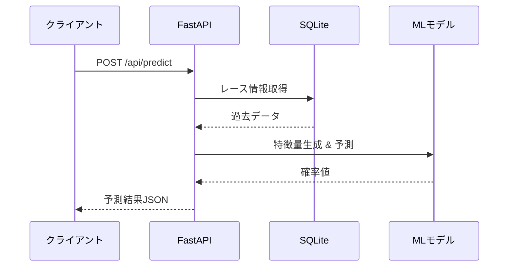

# FastAPI予測システム - クイックスタートガイド

## 🚀 システム構成

このプロジェクトは**FastAPI**を使用した競馬予測APIシステムです。

```
keiba-ai-pro/
├── python-api/           # FastAPI バックエンド
│   ├── main.py          # APIエンドポイント
│   └── requirements.txt
├── src/                 # Next.js フロントエンド
├── keiba/              # 機械学習コアモジュール
│   ├── keiba_ai/       # ML パイプライン
│   ├── data/           # SQLite データベース
│   └── models/         # 学習済みモデル
└── scraping_service_*.py  # スクレイピングサービス
```

---

## 📋 前提条件

- Python 3.10以上
- Node.js 18以上
- ProtonVPN（スクレイピング時）

---

## ⚡ クイックスタート

### 1️⃣ FastAPI起動

```powershell
# Terminal 1: FastAPIバックエンド
cd python-api
$env:PYTHONPATH="C:\Users\yuki2\Documents\ws\keiba-ai-pro"
uvicorn main:app --host 0.0.0.0 --port 8000 --reload
```

**確認:** http://localhost:8000 にアクセス

### 2️⃣ Next.js起動（オプション）

```powershell
# Terminal 2: Next.jsフロントエンド
npm run dev
```

**確認:** http://localhost:3000 にアクセス

---

## 📊 APIエンドポイント

### ヘルスチェック
```bash
GET http://localhost:8000/
```

### モデル学習
```bash
POST http://localhost:8000/api/train
Content-Type: application/json

{
  "target": "win",
  "model_type": "logistic_regression",
  "test_size": 0.2
}
```

**レスポンス例:**
```json
{
  "success": true,
  "model_id": "model_20260111_123456",
  "metrics": {
    "auc": 0.85,
    "log_loss": 0.32
  },
  "data_count": 1480,
  "race_count": 100,
  "feature_count": 68
}
```

### 予測実行
```bash
POST http://localhost:8000/api/predict
Content-Type: application/json

{
  "model_id": null,
  "horses": [
    {
      "horse_no": 1,
      "bracket": 1,
      "age": 3,
      "handicap": 54.0,
      "weight": 460,
      "weight_diff": 2,
      "entry_odds": 3.5,
      "entry_popularity": 2,
      "sex": "牡",
      "jockey_id": "00001",
      "trainer_id": "00101"
    }
  ]
}
```

### モデル一覧取得
```bash
GET http://localhost:8000/api/models
```

### モデル詳細取得
```bash
GET http://localhost:8000/api/models/{model_id}
```

---

## 🗄️ データ取得

### 1. スクレイピングサービス起動

```powershell
# Enhanced版（60列）
python scraping_service_enhanced.py

# Ultimate版（90列）推奨
python scraping_service_ultimate.py
```

**ポート:** 8001

### 2. CSV生成

```powershell
# Enhanced版
python export_to_csv.py

# Ultimate版
python export_ultimate_to_csv.py
```

### 3. データベース登録

```powershell
# 直接DBに登録
python keiba/register_to_db.py --race-ids 202401010101

# またはCSVからインポート
python csv_to_db_ultimate.py race_data_ultimate_*.csv
```

---

## 🧠 モデル学習

### コマンドライン実行

```powershell
cd keiba
python keiba_ai/train.py config.yaml
```

### API経由で実行

```powershell
curl -X POST http://localhost:8000/api/train `
  -H "Content-Type: application/json" `
  -d '{"target":"win","model_type":"logistic_regression"}'
```

---

## 📈 予測実行フロー



---

## 🔧 トラブルシューティング

### FastAPIが起動しない

```powershell
# PYTHONPATHを確認
echo $env:PYTHONPATH

# 正しく設定
$env:PYTHONPATH="C:\Users\yuki2\Documents\ws\keiba-ai-pro"
```

### モデルが見つからない

```powershell
# モデルディレクトリを確認
ls keiba/models/

# モデルを学習
cd keiba
python keiba_ai/train.py config.yaml
```

### データベースが空

```powershell
# データベース確認
python test_prediction_system.py

# データ取得
python keiba/register_to_db.py --race-ids 202401010101
```

### スクレイピングがブロックされる

1. **ProtonVPNを起動**（IP: 193.148.16.4推奨）
2. ブラウザを一度手動で開いてCookieを取得
3. `headless=False`で実行

---

## 📂 主要ファイル構成

```
python-api/
├── main.py                    # FastAPI メインファイル
├── requirements.txt           # Python依存関係
└── models/                    # モデル保存先（自動作成）

keiba/
├── keiba_ai/
│   ├── train.py              # モデル学習
│   ├── db.py                 # DB操作
│   ├── config.py             # 設定管理
│   └── feature_engineering.py # 特徴量エンジニアリング
├── data/
│   └── keiba.db              # SQLiteデータベース
└── models/                    # 共有モデル保存先

scraping_service_ultimate.py   # Ultimate版スクレイピング（推奨）
export_ultimate_to_csv.py      # Ultimate版CSV出力
csv_to_db_ultimate.py          # CSV→DB変換
```

---

## 🎯 推奨ワークフロー

### 初回セットアップ

```powershell
# 1. データ取得（Ultimate版）
python scraping_service_ultimate.py  # Port 8001
python export_ultimate_to_csv.py

# 2. データベース登録
python csv_to_db_ultimate.py race_data_ultimate_*.csv

# 3. モデル学習
cd keiba
python keiba_ai/train.py config.yaml

# 4. FastAPI起動
cd ../python-api
$env:PYTHONPATH="C:\Users\yuki2\Documents\ws\keiba-ai-pro"
uvicorn main:app --host 0.0.0.0 --port 8000
```

### 日常運用

```powershell
# FastAPI起動（バックグラウンド）
Start-Process powershell -ArgumentList "-NoExit", "-Command", `
  "cd C:\Users\yuki2\Documents\ws\keiba-ai-pro\python-api; `
  `$env:PYTHONPATH='C:\Users\yuki2\Documents\ws\keiba-ai-pro'; `
  uvicorn main:app --host 0.0.0.0 --port 8000"

# Next.js起動
npm run dev
```

---

## 📚 関連ドキュメント

- [DATABASE_SCHEMA_ANALYSIS.md](DATABASE_SCHEMA_ANALYSIS.md) - DB構造
- [FEATURES_DOCUMENTATION.md](FEATURES_DOCUMENTATION.md) - 特徴量説明（90列）
- [CSV_EXPORT_GUIDE.md](CSV_EXPORT_GUIDE.md) - CSV操作ガイド

---

## 💡 Tips

### PowerShellエイリアス設定

```powershell
# プロファイルを編集
notepad $PROFILE

# 以下を追加
function Start-KeibaAPI {
    cd C:\Users\yuki2\Documents\ws\keiba-ai-pro\python-api
    $env:PYTHONPATH="C:\Users\yuki2\Documents\ws\keiba-ai-pro"
    uvicorn main:app --host 0.0.0.0 --port 8000 --reload
}

# 使用方法
Start-KeibaAPI
```

### curlでテスト

```powershell
# 学習
curl -X POST http://localhost:8000/api/train `
  -H "Content-Type: application/json" `
  -d '{\"target\":\"win\"}'

# 予測
curl -X POST http://localhost:8000/api/predict `
  -H "Content-Type: application/json" `
  -d '{\"horses\":[{\"horse_no\":1,\"bracket\":1}]}'
```

---

## ✅ 動作確認

```powershell
# システムチェック
python test_prediction_system.py

# 期待される出力:
# ✅ データベース存在
# ✅ モデルディレクトリ存在
# ✅ 設定ファイル存在
# ✅ 予測機能インポート成功
```
