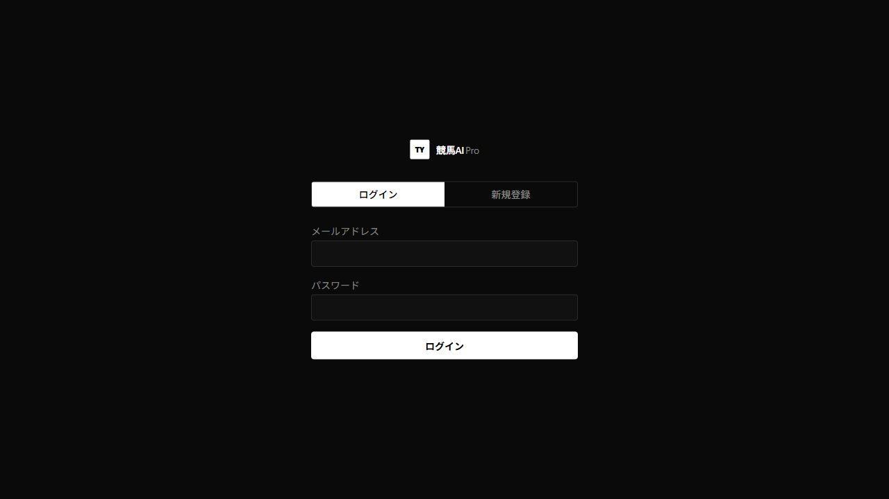
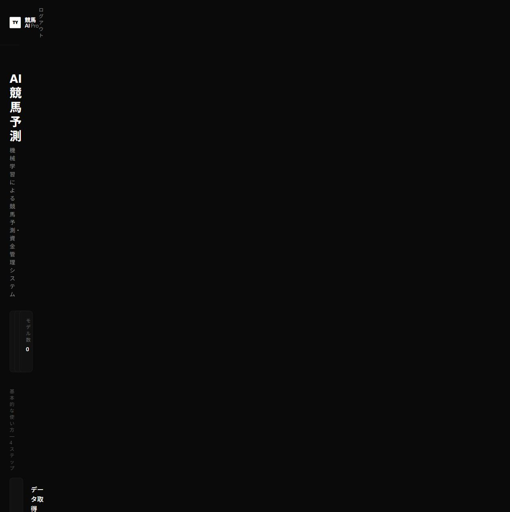
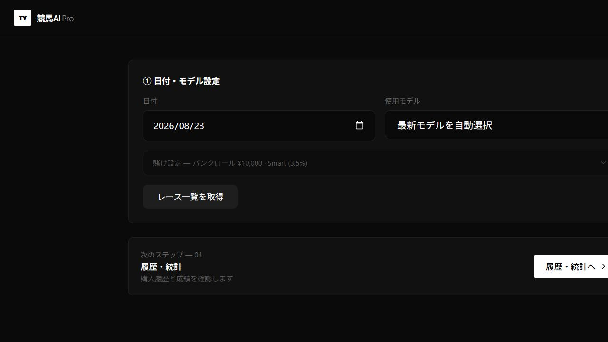
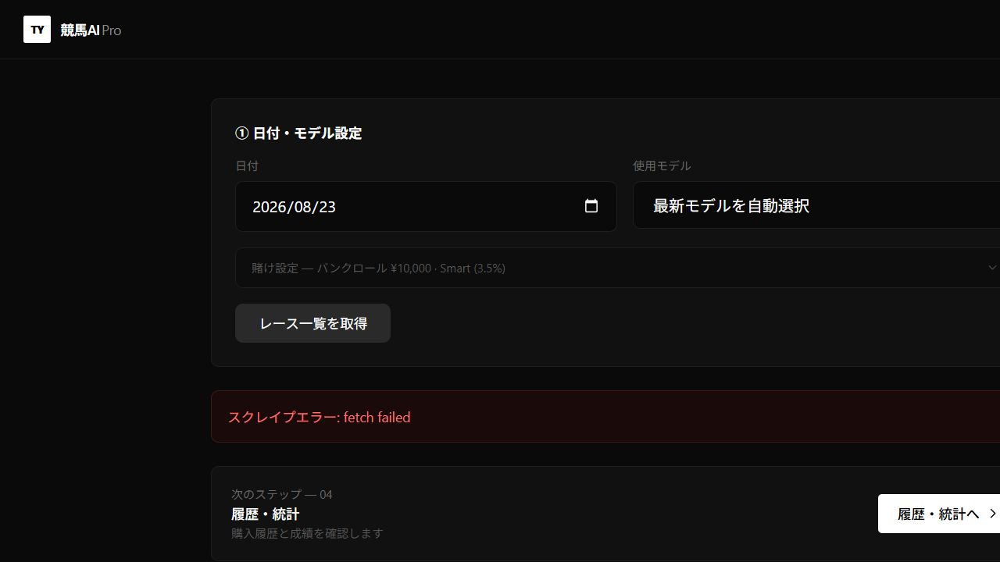
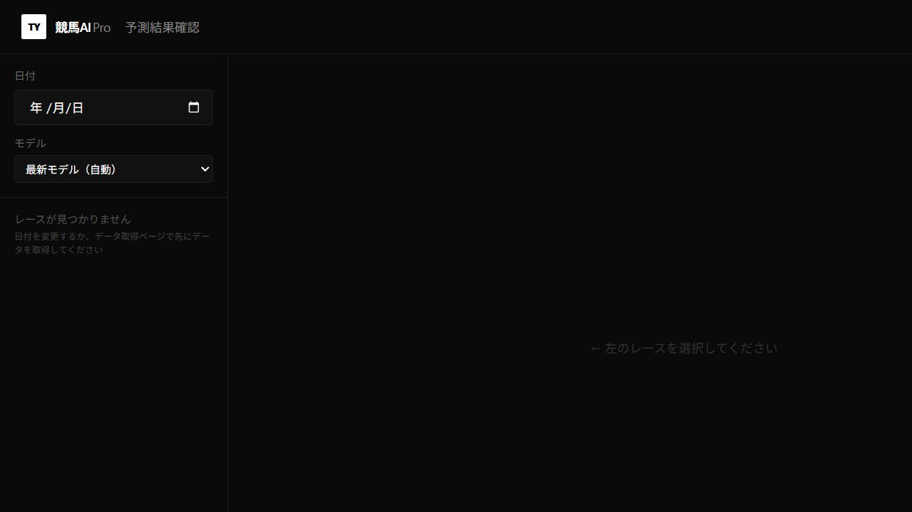
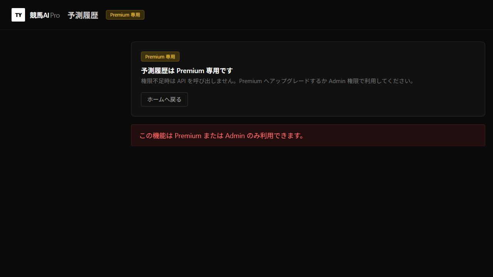
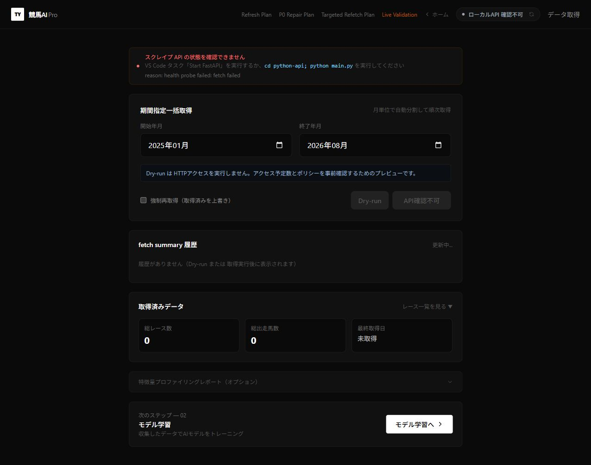
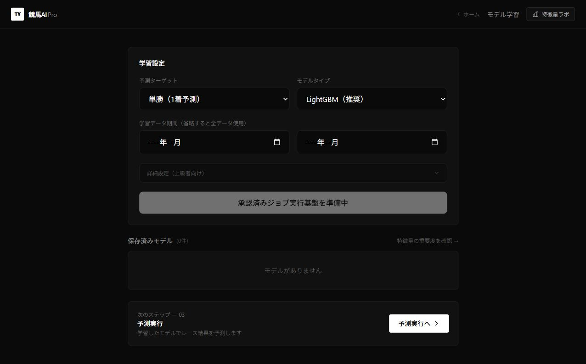
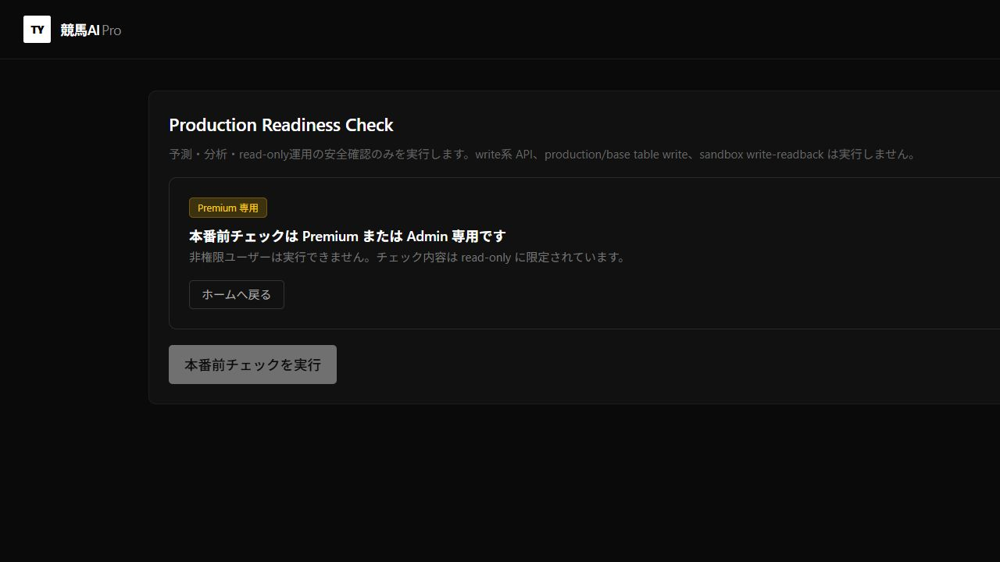

# 競馬AI Pro 操作手順書

> 正本: このMarkdownファイル  
> 配布版: `output/pdf/keiba-ai-pro-user-operation-guide.pdf`  
> 文書版: 1.2  
> 確認日: 2026-08-23  
> 対象環境: Limited Production / Observation

## 1. この手順書について

この文書は、Production Webアプリ「競馬AI Pro」を安全に操作するための利用者向け手順書です。一般利用者が使用する予測・分析画面と、Premium/Admin専用画面を区別して説明します。

アプリURL: <https://keiba-ai-pro.vercel.app>

### 現在のリリース状態

- WebアプリはLimited Productionとして公開されています。
- モデルの運用状態は`observation`です。
- 自動購入・自動ベットは無効です。
- 表示される購入推奨やvirtual betは検証用で、実際の馬券購入ではありません。
- 90日、1,000 settled samples、100 qualifying betsを含むModel Business Validationは継続中です。
- モデル学習・モデル有効化・Production設定変更は一般利用者の操作対象外です。

## 2. 権限と利用範囲

| 機能 | 一般利用者 | Premium/Admin | 現在のProduction状態 |
| --- | --- | --- | --- |
| ログイン・ホーム | 利用可 | 利用可 | 利用可 |
| 予測実行画面 | 閲覧・操作可 | 利用可 | レース一覧取得は接続状況に依存 |
| 予測スコア詳細 | 閲覧可 | 利用可 | 対象レースがDBにある場合に表示 |
| 成績確認 | 閲覧可 | 利用可 | データ未取得時は待機表示になる場合あり |
| 予測履歴 | 利用不可 | 利用可 | Premium/Admin専用 |
| データ取得 | 操作対象外 | 管理者運用 | Productionではローカル収集APIを使用しない |
| モデル学習 | 操作対象外 | 承認済み管理者のみ | 実行ボタン無効 |
| 本番前チェック | 利用不可 | 利用可 | read-onlyチェックのみ |

## 3. 利用モードとワンクリック起動

### 一般ユーザー: Production Web版

通常の利用者は<https://keiba-ai-pro.vercel.app>を開くだけです。PCへNode.js、Python、DBを導入する必要はありません。

Production Web版で「スクレイプAPIの状態を確認できません」と表示される問題は、スクレイプ系APIだけがVercel内部の`localhost:8000`を参照していたことが原因です。修正版では、専用URLがない場合に通常のRender FastAPIへ接続します。修正版のProductionデプロイが完了するまでは、次のローカル版を使用できます。

### 管理・開発ユーザー: ローカル完全版

このリポジトリ、承認済み環境ファイル、Python venv、Node依存、SQLite DB、モデルが揃っているPCでは、BATファイルから一括起動できます。

1. エクスプローラーでリポジトリ直下を開きます。
2. `start-keiba-ai-pro.bat`をダブルクリックします。
3. FastAPIとNext.jsのhealth確認が終わるまで待ちます。
4. ブラウザで<http://127.0.0.1:3000/login>が自動的に開きます。
5. 登録済みアカウントでログインします。

起動スクリプトは次を自動実行します。

- FastAPIを`127.0.0.1:8000`で起動
- Next.jsを`127.0.0.1:3000`で起動
- FastAPIとWeb側プロキシのhealthを確認
- ログを`logs/local-app/`へ保存
- Observationモード、スケジューラ停止、実投票資格情報なしで安全に起動

補助BATは次のとおりです。

| ファイル | 用途 |
| --- | --- |
| `start-keiba-ai-pro.bat` | アプリを一括起動してログイン画面を開く |
| `check-keiba-ai-pro.bat` | FastAPIとNext.jsの稼働状態を確認する |
| `stop-keiba-ai-pro.bat` | 起動BATが開始したプロセスだけを停止する |

停止BATは、他のNode.jsやPythonプロセスを一括終了しません。起動時に記録したPIDとプロセスツリーだけを停止します。

起動BATを誤って2回実行しても、既存プロセスを二重起動したり停止用PIDを上書きしたりしません。すでに正常起動している場合は、そのままログイン画面を開きます。

### ローカル起動に必要なもの

- `node_modules`とNode.js 18.17以降
- `python-api/.venv`またはルート`.venv`
- `.env.local`と必要な認証設定
- `keiba/data/keiba_ultimate.db`
- `python-api/models`内のモデル

これらは秘密情報や大容量DBを含むため、BATから自動ダウンロードしません。不足時は安全のため起動を中止し、画面に不足項目を表示します。

## 4. ログイン

1. <https://keiba-ai-pro.vercel.app/login>を開きます。
2. 登録済みのメールアドレスを入力します。
3. 更新済みのパスワードを入力します。
4. 「ログイン」を押します。
5. 「AI競馬予測」ホーム画面が表示されることを確認します。

### ログイン時の注意

- パスワードやAPIキーをチャット、Issue、画面キャプチャへ貼らないでください。
- ログインできない場合は、メールアドレスの前後に空白がないか確認します。
- 認証エラーが続く場合は、エラー文と発生時刻だけを管理者へ連絡します。パスワード自体は送らないでください。

## 5. ホーム画面

ログイン後、ホーム画面には4つの基本ステップと詳細分析メニューが表示されます。

### 画面上部の状態表示

- `API オンライン`: Webアプリのhealth確認が成功しています。
- `レース数`: Webアプリが参照できるレース件数です。
- `モデル数`: Webアプリが参照できるモデル件数です。

件数が`0`でもログイン障害とは限りません。Productionの観測データは別のバックエンド・収集経路で蓄積されるため、Web画面の参照経路が未接続の場合があります。

### 基本メニュー

1. データ取得: 管理者向けの収集画面です。
2. モデル学習: 承認済み管理者向けです。現在は実行できません。
3. 予測実行: 日付とモデルを指定して対象レースを表示します。
4. 成績確認: virtual betや予測結果の成績を確認します。

一般利用者は、まず「予測実行」または「予測スコア詳細」を使用します。

## 6. 予測を実行する

1. ホーム画面の「予測実行」を押します。
2. 「日付」に開催日を指定します。
3. 「使用モデル」は通常「最新モデルを自動選択」のままにします。
4. 賭け設定は検証用の表示です。Observation運用中は実購入されません。
5. 「レース一覧を取得」を押します。
6. レース一覧が表示されたら対象レースを選択します。
7. 予測順位、予測勝率、オッズ、期待値、推奨表示を確認します。

### 適格なレースの条件

検証用の正規観測として扱う場合は、次をすべて満たす必要があります。

- 実在する将来レースであること
- 結果確定前であること
- オッズ状態が`middle`であること
- 距離、出走馬、人気、オッズが揃っていること
- オッズ取得から30分以内であること

`yoso`、結果確定後のデータ、欠損したオッズ、合成データは正規証跡に使用しません。

### 「スクレイプエラー: fetch failed」と表示された場合

2026-08-23のProduction確認では、レース一覧取得時にこのエラーが表示されました。これは入力ミスではなく、スクレイプ系APIがVercel内部の`localhost:8000`を参照していたことが原因です。修正版のProductionデプロイ前はローカル完全版を使用し、デプロイ後も継続する場合は管理者へ連絡します。

1. 連続クリックや強制再取得は行いません。
2. 発生日時、指定日、表示されたエラー文を記録します。
3. 管理者へ連絡します。
4. Productionの定期Observation収集は別経路なので、Web画面のエラーだけで停止判断はしません。

## 7. 予測スコア詳細を確認する

1. ホーム画面の「予測スコア詳細」を押します。
2. 左側の「日付」を指定します。
3. モデルは通常「最新モデル（自動）」を選択します。
4. 左側へ表示されたレースを選択します。
5. 馬ごとの予測スコア、順位、特徴量を確認します。

「レースが見つかりません」と表示された場合は、その日付のレースがWeb画面の参照DBに存在しません。日付を確認し、管理者へデータ状況を問い合わせてください。Production画面からデータ取得を強行しないでください。

## 8. 成績と予測履歴を確認する

### 成績確認

ホーム画面の「成績確認」から、購入履歴、損益、回収率を確認します。Observation運用中の購入情報はvirtual betであり、実購入履歴ではありません。

画面が読み込み中のまま変化しない場合は、30秒待ってから1回だけ再読み込みします。改善しない場合は、発生時刻とURLを管理者へ連絡します。

### 予測履歴

「予測履歴」はPremium/Admin専用です。一般利用者にはAPIを呼び出さず、権限不足画面を表示します。

権限不足は障害ではありません。閲覧が必要な場合は、管理者が利用目的を確認して権限を付与します。

## 9. 管理者向け画面

### データ取得

「データ取得」はローカル収集APIまたは承認済み管理経路を前提とします。Production画面で「スクレイプAPIの状態を確認できません」「ローカルAPI確認不可」と表示される場合、取得ボタンは使用しません。

特に「強制再取得（取得済みを上書き）」は、承認済みの保守作業以外では選択しないでください。

#### ローカル完全版での安全な取得手順

1. `start-keiba-ai-pro.bat`をダブルクリックします。
2. ログイン後、ホームの「データ取得」を開きます。
3. 画面上部が「バックエンドAPI 稼働中」になることを確認します。
4. まず1か月だけ指定し、「Dry-run」を実行します。
5. 推定アクセス数と既存データ件数を確認します。
6. 通常は「強制再取得」を選択せず、必要な期間だけ本実行します。
7. 完了後、「取得済みデータ」とfetch summary履歴を確認します。
8. 利用終了時は`stop-keiba-ai-pro.bat`を実行します。

ローカル起動時は`SUPABASE_DATA_ENABLED=false`、`NETKEIBA_RACE_WRITE_ENABLED=false`で起動するため、取得結果はローカル研究DBへ保存し、Production DBや自動購入を変更しません。広い期間を一度に取得すると外部サイトへのアクセス数と所要時間が増えるため、必ずDry-run後に月単位で進めます。

2026-08-23の動作確認では、BAT起動後にFastAPI/Web health、認証、実レース一覧36件、1日分の非書き込みDry-run完了まで確認しています。

### モデル学習

現在のProductionでは「承認済みジョブ実行基盤を準備中」と表示され、学習実行は無効です。一般利用者は設定を変更しません。

モデル候補の作成、評価、承認、Activationは、Release Contractとtrusted evidenceを用いた別の管理手順で行います。

### 本番前チェック

Premium/Adminは「本番前チェック」からread-onlyのhealth、smoke、flag確認を実行できます。write系API、Production DB write、モデルActivationは実行しません。

## 10. 安全な利用ルール

- 自動ベットは常に無効であることを前提にします。
- Observation表示を利益保証やモデル承認済みの意味として扱いません。
- 実際の馬券購入判断は本アプリの検証範囲外です。
- APIキー、service-role key、パスワード、環境変数値を画面共有しません。
- Productionで強制再取得、モデル学習、モデル有効化、DB変更を行いません。
- 同じボタンを短時間に繰り返し押しません。
- 結果確定後のレースを前向き観測として登録しません。

## 11. トラブルシューティング

| 表示・症状 | 意味 | 対応 |
| --- | --- | --- |
| APIが確認中のまま | health応答待ち | 30秒待ち、1回だけ再読込 |
| APIオフライン | health確認失敗 | 時刻とURLを管理者へ連絡 |
| スクレイプエラー: fetch failed | Web画面と収集APIの接続失敗 | 再取得を連打せず管理者へ連絡 |
| レースが見つかりません | 指定日の参照データなし | 日付確認、データ状況を問い合わせ |
| モデルがありません | Web画面がモデルを参照できない | 学習を開始せず管理者へ連絡 |
| Premium専用 | 現在の権限では利用不可 | 必要性を管理者へ申請 |
| 読み込み表示が終わらない | APIまたはDB応答待ち | 30秒後に1回再読込、継続時は連絡 |

### 管理者へ連絡するときに記録する項目

- 発生日時（JST）
- 操作したURL
- 押したボタンまたは入力した日付
- 画面に表示されたエラー文
- 再読み込みを1回実施したか

パスワード、APIキー、Cookie、Authorization headerは記録・送信しません。

## 12. 利用終了

1. 右上の「ログアウト」を押します。
2. ログイン画面へ戻ったことを確認します。
3. ローカル完全版の場合は`stop-keiba-ai-pro.bat`を実行します。
4. 共用PCの場合はブラウザタブを閉じます。

## 13. 文書更新ルール

- このMarkdownを正本とします。
- UI、権限、Release Contract、Observation運用が変わった場合に更新します。
- PDFは正本更新後に再生成します。
- スクリーンショットには秘密情報や個人情報を含めません。

### 変更履歴

| 版 | 日付 | 内容 |
| --- | --- | --- |
| 1.2 | 2026-08-23 | レース一覧の単一FastAPI統合、二重起動防止、ローカルデータ取得手順と実測確認を追記 |
| 1.1 | 2026-08-23 | Production接続原因とWindowsワンクリック起動・停止・診断手順を追加 |
| 1.0 | 2026-08-23 | Production実画面を確認し、初版を作成 |
