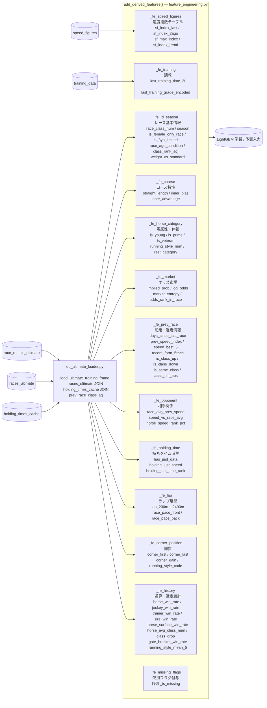

# 特徴量生成フロー — keiba-ai-pro



---

## 特徴量グループ一覧

| # | 関数 | カテゴリ | 主な特徴量 | ソース |
|---|---|---|---|---|
| 1 | `_fe_id_season()` | レース基本情報 | race_class_num, venue_code, season, cos/sin_date, is_female_only_race, is_3yo_limited, race_age_condition, class_rank_adj, weight_vs_standard | races_ultimate |
| 2 | `_fe_course()` | コース特性 | straight_length, inner_bias, inner_advantage | course_master.yaml |
| 3 | `_fe_horse_category()` | 馬属性・休養 | is_young/prime/veteran, running_style_num, rest_category | race_results_ultimate |
| 4 | `_fe_market()` | オッズ市場 | implied_prob, log_odds, market_entropy, odds_rank_in_race, popularity_normalized | race_results_ultimate |
| 5 | `_fe_prev_race()` | 前走・近走情報 | days_since_last_race, distance_change, prev_speed_index, recent_form_5race, speed_best_5, is_class_up/down, class_diff_abs | race_results_ultimate + lag |
| 6 | `_fe_opponent()` | 相手関係 | speed_vs_race_avg, horse_speed_rank_pct, race_avg_prev_speed | race_results_ultimate |
| 7 | `_fe_holding_time()` | 持ちタイム | has_just_data, holding_just_speed, holding_just_time_rank | holding_times_cache |
| 8 | `_fe_lap()` | ラップ展開 | lap_200m~2400m, lap_sect_*, race_pace_front/back/diff/ratio | races_ultimate |
| 9 | `_fe_corner_position()` | 脚質 | corner_first/last/gain, running_style_code | race_results_ultimate |
| 10 | `_fe_speed_figures()` | 速度指数 | sf_index_last/2ago/3ago, sf_max_index, sf_index_trend | speed_figures (optional) |
| 11 | `_fe_training()` | 調教 | last_training_time_3f, last_training_grade_encoded, training_comment_score | training_data (optional) |
| 12 | `_fe_history()` | 通算・近走統計 | horse/jockey/trainer/sire_win_rate, horse_surface/distance_win_rate, class_drop, gate_bracket_win_rate, running_style_mean_5 | expanding window |
| 13 | `_fe_missing_flags()` | 欠損フラグ | {col}_is_missing | — |

## パイプライン実行順序

```
load_ultimate_training_frame()   <- DB JOIN + prev_race_class lag
  |
  +-- _fe_days_from_history()    <- DB全履歴から days_since_last_race を正確計算
  +-- _fe_horse_category()
  +-- _fe_id_season()
  +-- _fe_course()
  +-- _fe_market()
  +-- _fe_prev_race()            <- is_class_up/down/same/diff_abs を含む
  +-- _fe_opponent()
  +-- _fe_holding_time()
  +-- _fe_lap()
  +-- _fe_payout()
  +-- _fe_corner_position()
  +-- _fe_speed_figures()
  +-- _fe_training()
  +-- _fe_history()              <- expanding window 統計 (P-6~P-10)
  +-- _fe_missing_flags()        <- 最後に欠損フラグ付与
  |
optimizer.py -> LightGBM 学習 / predict.py -> Kelly 推奨
```
