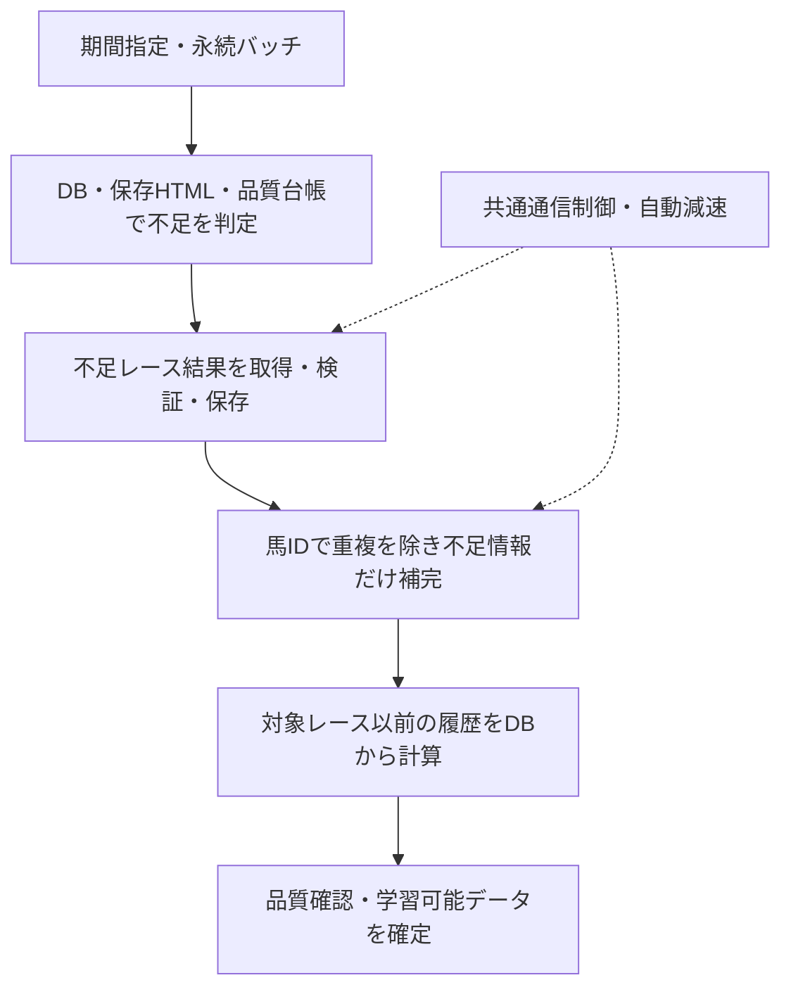

# 長期間データ取得の高速化設計

作成日: 2026-09-13。対象: 現在のローカルデータ取得画面による2016年〜2026年の取得。
状態: 第1段階の実装・追加最適化・オフライン比較を実施。レース解析＋馬情報補完のローカル処理は同じ品質で高速化したが、通信込みの全期間取得5倍は未検証・未達判定。以下には今後の設計も含む。追加依頼により2026-09-13 21:01 JSTにPythonを再起動し、既存UIの取得経路へ反映済み。実DBの再取得は行っていない。

実測・品質照合・制限事項は [検証結果](./acquisition-acceleration-verification.md) を参照。

## 今回の実装範囲

- 共有 SQLite lease による全 netkeiba ホストの発行間隔・同時通信制限、自動減速、429/503 の Retry-After 共有、401/403/制限画面の停止。
- カレンダー・一覧・レース・馬・血統・オッズ・内部取得・補完経路を共通通信層へ接続。オッズ用ブラウザは許可した netkeiba 配下の GET のみ中継し、Service Worker と外部トラッカーを禁止。
- 馬情報の解析結果と検証済み月別一覧の再利用、400 後に正常解析できた参照先の期限付き記憶。
- 古いレースの保存 HTML を品質確認して再利用。不足時は再通信し、当日・直近のレース本体は新規取得を維持。
- キャッシュ処理にも発生していた重複 sleep と過剰な GC の削減、ジョブ別通信指標、待機理由の進捗記録。
- SQLite接続の上限付き再利用、本文を読まない鮮度確認用索引、解析結果の上限付きメモリキャッシュ、必要なテーブル構造への軽量化、HTML解析の最大2ワーカー並列化。
- 取得本文と同時に記録した更新情報で解析キャッシュを照合。並列解析中の別処理による更新や、新旧入力の混在を検知して保存を見送る。

**未実装:** レース本体と補完の完全な二段階化、サーバー側の複数月永続バッチ、全取得経路を含む正確な残り時間表示。現在も馬情報の補完後にレースを保存し、次月の起動は従来の画面側処理。

比較では変更前コードと変更後コードに同じ保存 HTML を渡し、全出力項目・欠損・取得品質・学習対象判定を照合する。外部通信・実レート待機・本番 DB 保存を除くローカル実測なので、11年間の実取得時間の短縮率とは区別する。

## 1. 採用する方針

既存の月別ジョブ、品質台帳、HTTPキャッシュ、血統キャッシュ、中断・再開を拡張する。主な短縮手段は、必要な通信の削減と、通信待ち時間中のローカル処理である。通信速度は、全取得経路が共有する制御器で応答状況に応じて調整する。

netkeibaの公式案内は、多数のリクエストがサービスに支障を及ぼす場合、予告なく通信制限を行うとしている。この案内には安全な毎秒アクセス数は記載されていない。HTTPエラーが出なかった短時間の実績から許容限界を確定することはできない。

出典: [データベースの閲覧ができない・通信制限がかかった（スクレイピングについて）](https://support.keiba.netkeiba.com/hc/ja/articles/39720493823129-%E3%83%87%E3%83%BC%E3%82%BF%E3%83%99%E3%83%BC%E3%82%B9%E3%81%AE%E9%96%B2%E8%A6%A7%E3%81%8C%E3%81%A7%E3%81%8D%E3%81%AA%E3%81%84-%E9%80%9A%E4%BF%A1%E5%88%B6%E9%99%90%E3%81%8C%E3%81%8B%E3%81%8B%E3%81%A3%E3%81%9F-%E3%82%B9%E3%82%AF%E3%83%AC%E3%82%A4%E3%83%94%E3%83%B3%E3%82%B0%E3%81%AB%E3%81%A4%E3%81%84%E3%81%A6)（2026-09-13確認）。

既存仕様の最低1秒を下限として維持する。これは本アプリの制約であり、提供元が認めた安全速度ではない。

## 2. 現状の根拠

### ローカル記録の実測

`keiba/data/scrape_jobs.db` のジョブ `7efc7d56-3e03-4b42-a5ec-cd98062104df` は、対象日2026-09-13の取得で以下を記録している。

| 項目 | 記録値 |
| --- | ---: |
| 保存レース | 24 |
| 保存出走馬 | 314 |
| 所要時間 | 429.37秒（約7分9秒） |
| HTTPアクセス | 670 |
| 再試行・429・403・500・503 | いずれも0 |

同時間帯の `keiba/data/fetch_cache.db` の取得時刻・URLメタデータには、馬成績311件、血統311件の成功レスポンスがある。約93%相当が馬情報・血統取得だったことを示唆する。ただしキャッシュはジョブ別ではないため、厳密なジョブ内訳は今後の計測で確定する。

既存DBの2016〜2026年に該当する出走馬結果303,296行に対し、異なる馬IDは50,233件。同じ馬が平均約6行に現れるため、馬ID単位の再利用が有効。ただし現行もHTTPキャッシュと血統キャッシュを持つため、これをそのまま6倍の高速化と解釈しない。

全期間のDB総数53,717レース・591,506行は2013〜2015年も含む。2016〜2026年の取得完了数や残数として使わない。また上記の1日分から11年間の所要時間を単純外挿しない。

### コードで確認した課題

| 現在の実装 | 時間・信頼性への影響 | 主な対象 |
| --- | --- | --- |
| レースを1件処理するたび、馬成績・不足血統を補完する | レース結果の収集が追加情報の取得完了を待つ。`quick_mode`でも馬成績取得は残る | `scraping/race.py`, `mobile_race.py`, `horse.py` |
| 同一月のモバイル一覧を日ごとに走査する | HTTPキャッシュが効いてもHTMLの読み込み・再解析を繰り返す | `scraping/race_list.py` |
| 一部の旧URLで400を受けてから別形式を参照する | 既知の非対応URLへの失敗通信を繰り返す | `scraping/race.py`, `horse.py` |
| キャッシュとは別に日付・レース・馬4頭ごとの待機がある | キャッシュのみの処理でも固定待機が残る | `scraping/jobs.py`, `race.py`, `mobile_race.py` |
| 不足レース取得は一律 `force_refresh=True` | 保存HTMLを再解析するだけで直るケースも再通信になる | `scraping/jobs.py` |
| 待機判定とリクエスト開始記録が別操作 | 複数タスクが同じ時刻に起きて送信でき、1秒間隔を保証できない | `fetch_pipeline.py` の `_respect_rate_limit`, `_record_request_start` |
| レート制御はプロセス内・ホスト別。一部経路は直接HTTP | 別ジョブ・サブドメイン・カレンダー・オッズの合算負荷を制御できない | `fetch_pipeline.py`, `jobs.py`, `odds.py`, `routers/realtime_odds.py` |
| 403が再試行対象外なので成功側で失敗数がリセットされる | 制限検知と正常応答の区別が不十分 | `fetch_pipeline.py` の `_network_fetch` |
| Retry-After待機はそのリクエストだけ | 他の待機中タスクが通信を続けられる | 同上 |
| 事前確認は日付一覧2URL/日を数え、件数×1秒で見積もる | レース詳細・馬・血統を含まないため全体ETAになっていない | `scraping/jobs.py` のdry-run分岐 |
| 月の開始・次月への移行はブラウザ側ループ | 開始済み月はサーバーで続くが、画面を閉じると次月を開始できない | `src/hooks/useBatchScrape.ts` |

再利用する部分: `completed_quality_dates`、`hydrate_quality_from_existing_data`、`scrape_repair_queue`、HTTPキャッシュとURL重複排除、血統SQLite、ジョブ永続化・所有者検証・停止境界・メモリ待機。

## 3. 取得と補完を分ける

1. **取得前に不足を確定する。** DBの確定結果が品質検査を通ればスキップ。保存HTMLが利用できれば最新パーサーで再解析し、足りないデータだけ通信する。既存の完了判定は維持する。
2. **レース本体を先に集める。** 出走情報、結果、タイム、オッズ・人気、払戻などをレースページから保存する。追加プロフィールの取得を待たず、次の必要レースへ進む。
3. **馬・血統をID単位でまとめる。** 既存の血統DBを一括参照し、不足するプロフィール・血統だけ作業リストへ入れる。同じ馬が複数の月やレースに登場しても重複取得しない。未取得項目・出典・取得日・再確認期限を持つ。
4. **過去成績はローカル結果から計算する。** 過去のレースごとに現在の馬ページを取り直す代わりに、学習対象レースより前の記録から前走・適性・安定性を作る。`local_feature_contract.py` と既存の時点整合履歴処理を利用する。期間開始より前の履歴不足は欠損として記録し、未来の成績で埋めない。
5. **取得完了と学習可能を区別する。** `race_core_complete`、`enrichment_pending`、`training_eligible`を別に管理する。補完未実施を全特徴量取得済みと表示しない。学習必須条件を緩めず、利用する特徴量・補完状況を学習スナップショットに記録する。

この二段階方式で途中成果を公開する対象は、確定済みの過去レースに限定する。当日・直近日の予測用データは、現行の出馬表・過去走・血統の整合したスナップショットを維持する。補完前のデータは準備領域に置き、予測に必要な情報が揃うまで予測可能としない。更新時も準備領域から一貫した単位で切り替え、予測が補完途中の行を参照しないようにする。

最初に学習用の基礎データが揃うまでの時間と、補完まで含む総時間を別々に測る。補完を後回しにしただけの時間短縮を、全取得の高速化として報告しない。

## 4. 通信の速度調整

### 共通制御

- 現行FastAPIのローカル取得サービスを唯一の通信実行者とし、他のジョブ・カレンダー・日付一覧・馬・血統・オッズも同じ制御を通す。別プロセスからの取得もこのサービスへ依頼する。
- `netkeiba.com`配下の対象ホスト全体の間隔・休止期限を共有し、ホスト別制約も併用する。サブドメインの数で通信予算が増えない構造にする。
- 初期実装では外部HTTP同時実行数1。発行判断、共有休止期限の再確認、開始時刻記録を一体化する。自動リダイレクトによる追加通信も制御対象にする。
- HTML解析・ローカル保存は通信と重ねる。解析キューは小さく制限し、保存担当は1つ。キュー詰まり・メモリ不足時には新規通信を待機する。
- カウントするのは開始した全試行。400、タイムアウト、再試行、フォールバックも記録する。成功数はHTTP成功と解析・品質検証成功を分ける。
- 保存内容・品質台帳を一貫した単位で確定してから完了チェックポイントを進める。別DBのジョブ進捗は再読込で復元できるようにする。

### 初期パラメータ案

以下はアプリ内部の初期設定案であり、netkeibaの許容値ではない。実施時は通常取得の計測を使って評価する。

| 観測 | 動作 |
| --- | --- |
| 初回 | リクエスト開始間隔2秒、同時通信1 |
| 同じページ種別で正常取得50件以上、かつ2分以上安定 | 間隔を10%ずつ短縮。最低1秒まで |
| 応答時間p95が同ページ種別の安定時の約2倍、または5xx・タイムアウト | 加速を停止し、間隔を延長。再試行予算を共通で管理 |
| 429 | 全体を休止。`Retry-After`と内部待機5分の長い方を採用。待機後は間隔を広げて再開し、繰り返す場合は長時間休止 |
| 401・403・アクセス制限画面 | `paused`として保存し、自動再試行と別ホストへの切替を停止 |
| スキーマ不一致・結果未公開 | 失敗の種類を記録し、即時再試行ループに入れない |

Retry-Afterは秒数とHTTP日時の両形式を扱い、上限値で切り詰めて早期再開しない。新しく休止が発生した場合、すでに待機中の依頼にも反映する。アプリ再起動で休止を消さない。

現状は同時発行が起き得るので、間隔保証だけを直すと所要時間が延びる可能性がある。通信削減と合わせた実測で改善を評価する。

## 5. 保存データの再利用

| データ | 方針 |
| --- | --- |
| 確定済みの古いレースHTML | 検証済みスナップショットを圧縮保存。内容ハッシュ・出典・取得日時・パーサー版を持ち、再解析に使用 |
| 当日・直近日の出馬表、オッズ、未確定結果 | 短い有効期限。公開段階を持ち、結果確定前の内容を恒久再利用しない |
| 血統など変化の少ない属性 | 馬IDで構造化キャッシュ。不足・訂正が判明した項目を再確認 |
| 現在の馬成績・調教師など変化する情報 | 取得時点を持つ。昔のレースの属性・履歴として無条件に再利用しない |
| 月別レース一覧 | 月全ページの取得・検証が揃ってから日付→レースIDの索引を保存。途中失敗の一覧は完了扱いしない |
| 開催なし記録 | 既存の有効期限・直近日再確認・カレンダーとの矛盾時無効化を維持 |

HTMLキャッシュには現時点で約2.17GBのファイルがあるため、保存容量・圧縮・重複排除・保持期限を設計に含める。未検証のHTTP 200本文や制限画面を、再利用可能な成功スナップショットに昇格させない。

旧URLの400と、新形式で妥当なデータを得られた組合せは、ページ種別ごとに期限付きで記録する。その期間は実績のある形式を使い、失敗するURLへの毎回の通信を省く。400だけでは互換性問題と断定せず、401・403・429や制限画面はこの切替の対象にしない。

## 6. 中断・再開と画面

2016年1月〜2026年9月は129か月。新しい永続バッチに全体期間・月一覧・現在位置を保存し、既存の31日以内の子ジョブを順番に実行する。月・日付の並列取得は追加しない。

バッチと子ジョブの所有者・要求内容を結びつける。同一所有者の実行中判定をバッチにも拡張し、次月起動は冪等にする。停止要求後に次月を開始しない。処理中に再起動した場合は、既存チェックポイントと作業結果を照合してから未完了だけ再開する。

長期間ジョブは、ブラウザを閉じてもローカルサーバーが動いていれば次月へ進む。PC停止中に処理が進むとは表示しない。

画面に増やす表示は次の範囲とする。

- 状態: `レース取得中` / `不足情報を補完中` / `自動減速中` / `待機中` / `完了`
- 件数: `保存済み`、`残り`。開始前に分からない残数は`確認中`
- 残り時間: 実測に基づく概算範囲。サーバー制限による待機中は再開予定を表示
- 操作: `停止` / `再開`

HTTP内訳・キャッシュ率・待機理由・品質不足件数は「詳細」にまとめる。通常画面には速度調整ノブや多数のモードを追加せず、自動調整を標準とする。

## 7. 見積もりと計測

事前確認は外部HTTPなしを維持する。DB・キャッシュから未取得レース数、未補完の異なる馬数、必要な一覧ページ数を計画する。未取得の月一覧などが必要で正確な数が分からなければ範囲見積もりにする。

HTTP予定数は、`一覧 + 不足レース + 不足プロフィール + 不足血統 + 予備再試行`を重複除去した作業単位で積み上げる。キャッシュとDBの重複したスキップを二重計上しない。

所要時間はページ種別の実測応答時間、共通間隔、解析・保存の処理速度、休止時間から推定する。ローカル処理と通信を重ねた分を二重加算しない。ジョブ別・バッチ別に以下を残す。

- 全HTTP開始数、HTTPコード別件数、正常解析数、取得バイト数
- DBスキップ数、HTTPキャッシュ利用数、構造化キャッシュ利用数、重複排除数
- ページ種別のp50/p95応答時間、レート待機、バックオフ待機、ローカル資源待機
- HTML解析時間、DB保存時間、基礎データ完了時間、補完完了時間
- 品質合格レース数・学習対象件数・主要特徴量の欠損率

現行のグローバル指標を終了時にresetする方式では他ジョブが混ざり得るため、依頼にjob_id/batch_idを付けて帰属させる。共有HTTP1件を複数依頼が利用した場合も通信実績を重複計上しない。

## 8. 実装順序と確認条件

| 順序 | 実装 | 確認する結果 |
| --- | --- | --- |
| 1 | 計測の追加、共通レート制御、制限応答の分類 | 複数タスク・別機能でも間隔と休止が守られる |
| 2 | レース本体と補完の分離、馬ID単位の再利用、月一覧索引 | 同じ入力範囲・品質条件でHTTP数が減る |
| 3 | 保存HTML再解析、理由別の再取得、重複待機の整理 | 有効な保存データだけで完結する作業のHTTP数が0 |
| 4 | 永続バッチ、停止・再開、概算時間とシンプルな表示 | 画面を閉じても次月へ進み、停止・再起動後に重複が生じない |
| 5 | 実測に基づく自動減速・回復 | 制限応答時に通信を抑え、通常時の有効取得速度が改善する |

最初の検証は保存HTMLと模擬HTTP・時計で行う。通常取得の実測で比較する際も、速度限界を探る追加リクエストを発生させず、必要な未取得データを使う。

回帰確認は、同時待機の発行間隔、待機中に追加されたRetry-After、403/制限HTML、重複依頼の停止、月全ページ未完了、再起動直前・直後の保存、対象日以降の履歴混入、当日予測への補完途中データの混入、既存学習品質判定を重点とする。

`docs/specs/SYSTEM.md` / `docs/specs/scraping.md` の分散sleep前提を、実装時に共通発行間隔へ更新する。修復計画の非実行ルートを流用して権限を拡張せず、現在のローカル取得ジョブと同じ認証・保存範囲で拡張する。

達成目標は、**同じ品質の学習用データを、少ない通信と短い実時間で揃えること**。何倍速になるかは、上記の通信内訳と品質を揃えた比較で確定する。
