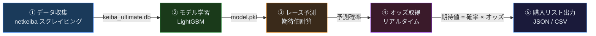
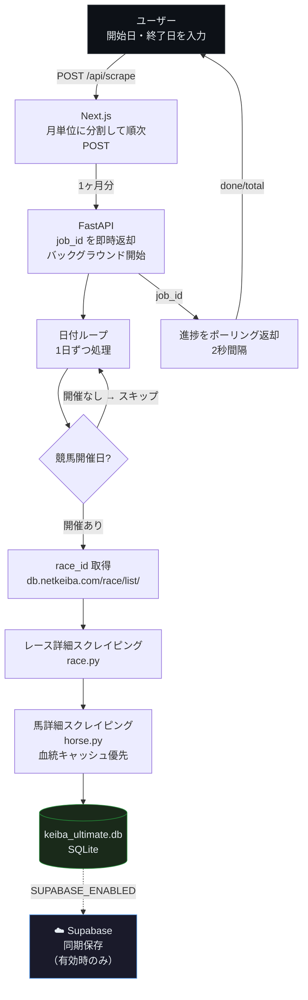
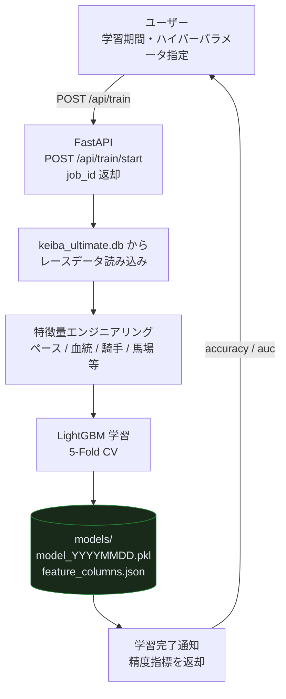
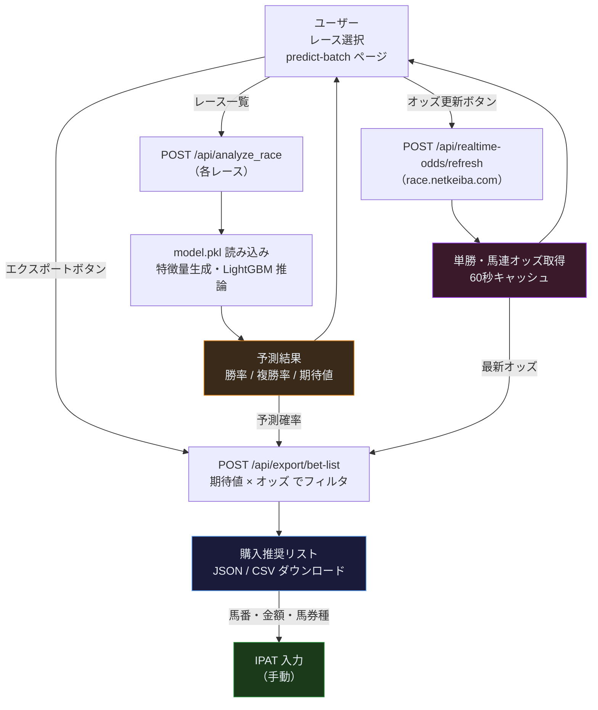
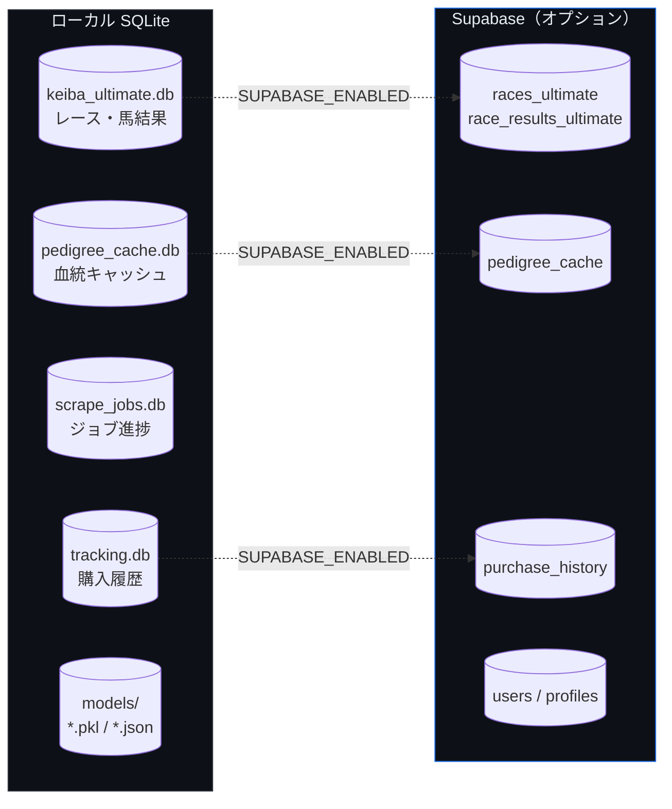

# keiba-ai-pro システム全体データフロー

---

## 全体パイプライン（5ステップ）

```mermaid
flowchart LR
    S1["① データ収集\nnetkeiba スクレイピング"]
    S2["② モデル学習\nLightGBM"]
    S3["③ レース予測\n期待値計算"]
    S4["④ オッズ取得\nリアルタイム"]
    S5["⑤ 購入リスト出力\nJSON / CSV"]

    S1 -->|"keiba_ultimate.db"| S2
    S2 -->|"model.pkl"| S3
    S3 -->|"予測確率"| S4
    S4 -->|"期待値 = 確率 × オッズ"| S5

    style S1 fill:#1a3a5a,stroke:#1f6feb,color:#e6edf3
    style S2 fill:#1a3a1a,stroke:#238636,color:#e6edf3
    style S3 fill:#3a2a1a,stroke:#d97706,color:#e6edf3
    style S4 fill:#3a1a2a,stroke:#9333ea,color:#e6edf3
    style S5 fill:#1a1a3a,stroke:#60a5fa,color:#e6edf3
```

---

## ① データ収集フロー

```mermaid
flowchart TD
    A["ユーザー\n開始日・終了日を入力"] 
    B["Next.js\n月単位に分割して順次POST"]
    C["FastAPI\njob_id を即時返却\nバックグラウンド開始"]
    D["日付ループ\n1日ずつ処理"]
    E{"競馬開催日?"}
    F["race_id 取得\ndb.netkeiba.com/race/list/"]
    G["レース詳細スクレイピング\nrace.py"]
    H["馬詳細スクレイピング\nhorse.py\n血統キャッシュ優先"]
    I[("keiba_ultimate.db\nSQLite")]
    J["☁️ Supabase\n同期保存\n（有効時のみ）"]
    K["進捗をポーリング返却\n2秒間隔"]

    A -->|"POST /api/scrape"| B
    B -->|"1ヶ月分"| C
    C --> D
    D --> E
    E -->|"開催あり"| F
    E -->|"開催なし → スキップ"| D
    F --> G
    G --> H
    H --> I
    I -.->|"SUPABASE_ENABLED"| J
    C -->|"job_id"| K
    K -->|"done/total"| A

    style A fill:#0d1117,stroke:#30363d,color:#e6edf3
    style I fill:#1a2a1a,stroke:#238636,color:#e6edf3
    style J fill:#1a1a2a,stroke:#60a5fa,color:#e6edf3
```

---

## ② モデル学習フロー

```mermaid
flowchart TD
    A["ユーザー\n学習期間・ハイパーパラメータ指定"]
    B["FastAPI\nPOST /api/train/start\njob_id 返却"]
    C["keiba_ultimate.db から\nレースデータ読み込み"]
    D["特徴量エンジニアリング\nペース / 血統 / 騎手 / 馬場 等"]
    E["LightGBM 学習\n5-Fold CV"]
    F[("models/\nmodel_YYYYMMDD.pkl\nfeature_columns.json")]
    G["学習完了通知\n精度指標を返却"]

    A -->|"POST /api/train"| B
    B --> C
    C --> D
    D --> E
    E --> F
    F --> G
    G -->|"accuracy / auc"| A

    style F fill:#1a2a1a,stroke:#238636,color:#e6edf3
```

---

## ③④⑤ 予測・オッズ・購入リスト出力フロー

```mermaid
flowchart TD
    A["ユーザー\nレース選択\npredict-batch ページ"]
    
    B["POST /api/analyze_race\n（各レース）"]
    C["model.pkl 読み込み\n特徴量生成・LightGBM 推論"]
    D["予測結果\n勝率 / 複勝率 / 期待値"]

    E["POST /api/realtime-odds/refresh\n（race.netkeiba.com）"]
    F["単勝・馬連オッズ取得\n60秒キャッシュ"]

    G["POST /api/export/bet-list\n期待値 × オッズ でフィルタ"]
    H["購入推奨リスト\nJSON / CSV ダウンロード"]
    I["IPAT 入力\n（手動）"]

    A -->|"レース一覧"| B
    B --> C
    C --> D
    D --> A

    A -->|"オッズ更新ボタン"| E
    E --> F
    F --> A

    A -->|"エクスポートボタン"| G
    D -->|"予測確率"| G
    F -->|"最新オッズ"| G
    G --> H
    H -->|"馬番・金額・馬券種"| I

    style D fill:#3a2a1a,stroke:#d97706,color:#e6edf3
    style F fill:#3a1a2a,stroke:#9333ea,color:#e6edf3
    style H fill:#1a1a3a,stroke:#60a5fa,color:#e6edf3
    style I fill:#1a3a1a,stroke:#238636,color:#e6edf3
```

---

## データストア全体像

```mermaid
flowchart LR
    subgraph LOCAL["ローカル SQLite"]
        DB1[("keiba_ultimate.db\nレース・馬結果")]
        DB2[("pedigree_cache.db\n血統キャッシュ")]
        DB3[("scrape_jobs.db\nジョブ進捗")]
        DB4[("tracking.db\n購入履歴")]
        DB5[("models/\n*.pkl / *.json")]
    end

    subgraph CLOUD["Supabase（オプション）"]
        SB1[("races_ultimate\nrace_results_ultimate")]
        SB2[("pedigree_cache")]
        SB3[("purchase_history")]
        SB4[("users / profiles")]
    end

    DB1 -.->|"SUPABASE_ENABLED"| SB1
    DB2 -.->|"SUPABASE_ENABLED"| SB2
    DB4 -.->|"SUPABASE_ENABLED"| SB3

    style LOCAL fill:#0d1117,stroke:#30363d,color:#e6edf3
    style CLOUD fill:#0d1117,stroke:#1f6feb,color:#e6edf3
```
