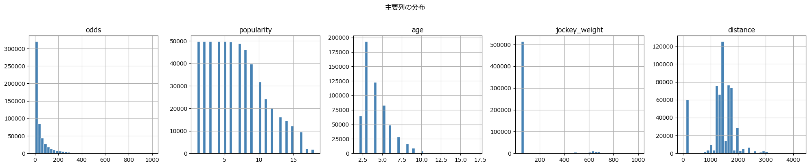
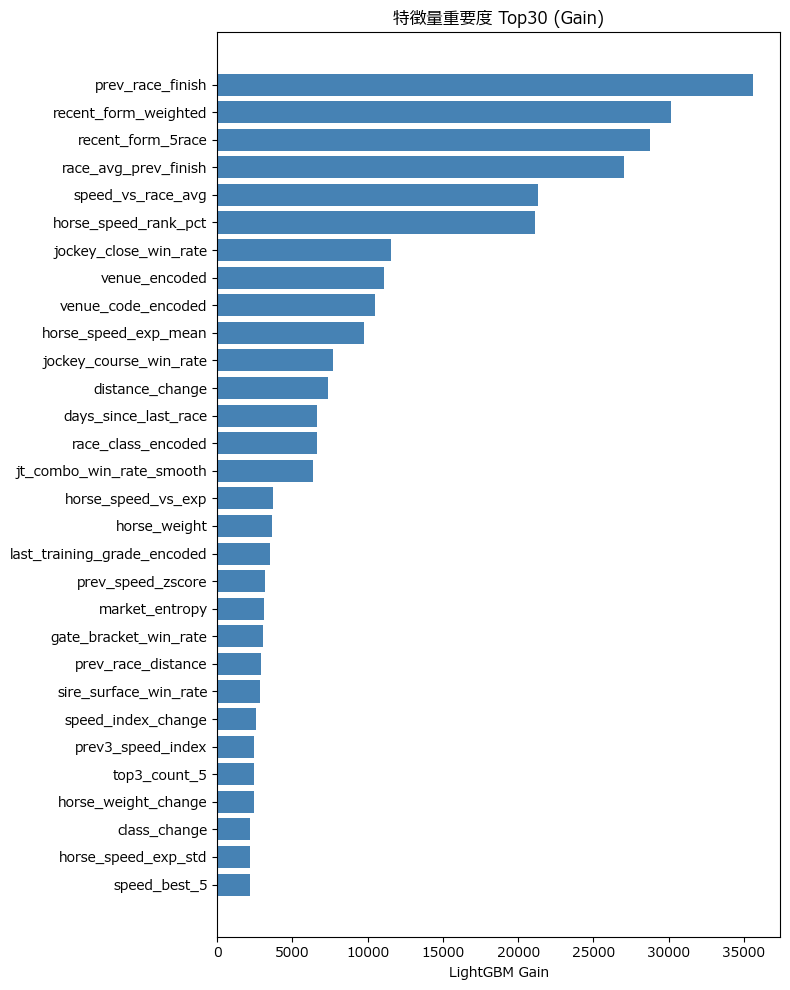
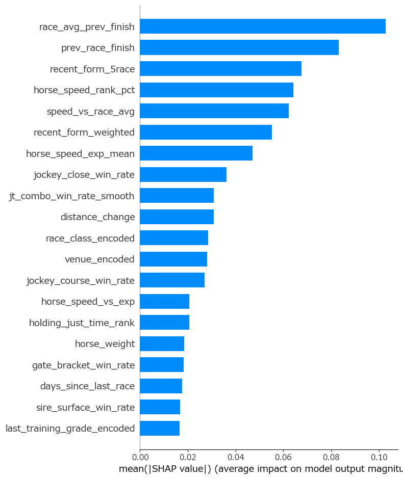
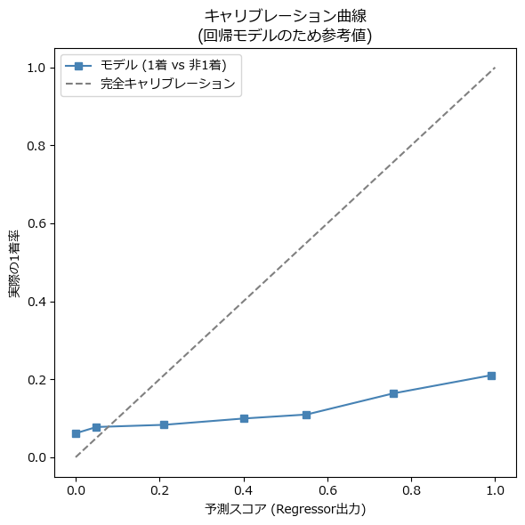
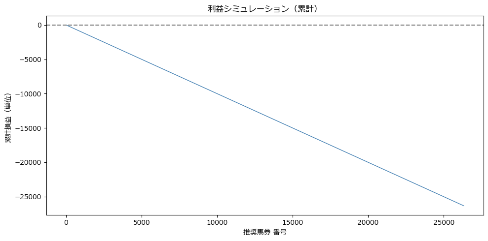

# 競馬 AI 予測システム — 分析レポート

**生成日時**: 2026-07-04 18:13:42

---

## 1. データ品質

# データ品質チェックレポート

生成日時: 2026-07-04 17:45:17
DB: C:\Users\yuki2\Documents\ws\keiba-ai-pro\keiba\data\keiba_ultimate.db
行数: 575,346  列数: 132

## 欠損率
- 欠損あり列数: 98 / 132
- 欠損率 > 10%: 77 列
- 欠損率 > 50%: 30 列
- 欠損率 > 90%: 11 列

## 異常値（3σ法）
- 外れ値 > 0.1% の列数: 56

## 重複
- 完全重複: 0  (race_id, horse_id): 0

## データリーク候補
- FUTURE_FIELDS 混入: 16 列

---

## 2. 特徴量概要

- 総特徴量数: **146**

- カテゴリ特徴量数: **5**

- 欠損率 > 50% の特徴量: **14**

---

## 3. 特徴量重要度 (LightGBM Gain Top20)

| feature                     |   lgb_gain |   spearman_r |
|:----------------------------|-----------:|-------------:|
| prev_race_finish            |   35617.2  |      -0.297  |
| recent_form_weighted        |   30130.9  |      -0.3105 |
| recent_form_5race           |   28780.4  |      -0.3046 |
| race_avg_prev_finish        |   27027.6  |       0.002  |
| speed_vs_race_avg           |   21299.6  |       0.2089 |
| horse_speed_rank_pct        |   21095.6  |      -0.1906 |
| jockey_close_win_rate       |   11580.5  |       0.1953 |
| venue_encoded               |   11090.1  |      -0.0018 |
| venue_code_encoded          |   10452.1  |      -0.0021 |
| horse_speed_exp_mean        |    9720.63 |       0.0858 |
| jockey_course_win_rate      |    7715.63 |       0.186  |
| distance_change             |    7380.78 |      -0.0373 |
| days_since_last_race        |    6654.18 |      -0.0041 |
| race_class_encoded          |    6651.83 |       0.0017 |
| jt_combo_win_rate_smooth    |    6377.36 |       0.1623 |
| horse_speed_vs_exp          |    3705.09 |       0.0154 |
| horse_weight                |    3658.66 |       0.061  |
| last_training_grade_encoded |    3535.58 |       0.0091 |
| prev_speed_zscore           |    3143.94 |       0.143  |
| market_entropy              |    3078.82 |       0.0057 |

---

## 4. モデル学習

- 学習日時:      2026-06-29T21:26:30.012369

- 目的変数:      speed_deviation

- CV AUC:        **N/A ± N/A**

- Test AUC:      **nan**

- Test LogLoss:  nan

- 特徴量数:      146

- Optuna Trials: 5

---

## 5. 高相関特徴量ペア (|r| ≥ 0.90)

- 該当ペア数: 69

| A                    | B                               |       r |
|:---------------------|:--------------------------------|--------:|
| prev_race_class_num  | prev_class_rank                 |  1      |
| class_rank_adj       | race_class_rank                 |  0.9999 |
| speed_avg_weighted   | speed_best_2                    |  0.9997 |
| race_avg_prev_speed  | race_max_prev_speed             |  0.9991 |
| has_just_data        | holding_just_speed              |  0.9987 |
| speed_best_2         | speed_best_5                    |  0.9975 |
| speed_avg_weighted   | speed_best_5                    |  0.9973 |
| horse_speed_exp_mean | horse_speed_exp_mean_is_missing | -0.996  |
| holding_just_l3f     | has_just_data                   |  0.9946 |
| race_avg_prev_speed  | race_avg_prev_speed_is_missing  | -0.9937 |

---

## 6. 評価

# 評価レポート

生成日時: 2026-07-04 18:12:04

## モデル精度
- AUC (1着 vs 非1着): 0.6516
- Spearman 平均相関:   -0.3070
- RMSE:                0.7955

## 順位精度
- NDCG:         nan
- MAP: N/A
- 単勝的中率:   33.9%

## 回収率
- ROI:          -100.0%

---

## 7. 図一覧

### distribution.png

### feature_importance.png

### shap_summary.png

### calibration.png

### profit_simulation.png

